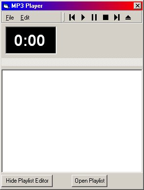



## Advanced MP3 Player Thingy\!\!

### Description

Really cheesy name but i had to come up one! Simple kind of MP3 player that DOESN'T use the Windows Media Player Control (I was getting kind of sick of it). It uses the "Impulse MP3" control that comes with Impulse Studio. Only supports MP3 and MPU file extentions as far as i know. Could play others. Supports drop and draging of files and command line arguments (eg. "c:\My Documents\MP3 Player.exe <MP3Filename>"). also has a simple playlist. You may have to register the "ImpulseMP3.OCX" file that is included. Not fully finished or bug proof. Any comments would be nice!!
 
### More Info
 

             |
---                |---
**Submitted On**   |2000-12-14 04:55:10
**By**             |[Gerard Dummett](https://github.com/Planet-Source-Code/PSCIndex/blob/master/ByAuthor/gerard-dummett.md)
**Level**          |Intermediate
**User Rating**    |2.3 (14 globes from 6 users)
**Compatibility**  |VB 6\.0
**Category**       |[Sound/MP3](https://github.com/Planet-Source-Code/PSCIndex/blob/master/ByCategory/sound-mp3__1-45.md)
**World**          |[Visual Basic](https://github.com/Planet-Source-Code/PSCIndex/blob/master/ByWorld/visual-basic.md)
**Archive File**   |[CODE\_UPLOAD1265312132000\.zip](https://github.com/Planet-Source-Code/gerard-dummett-advanced-mp3-player-thingy__1-13569/archive/master.zip)

